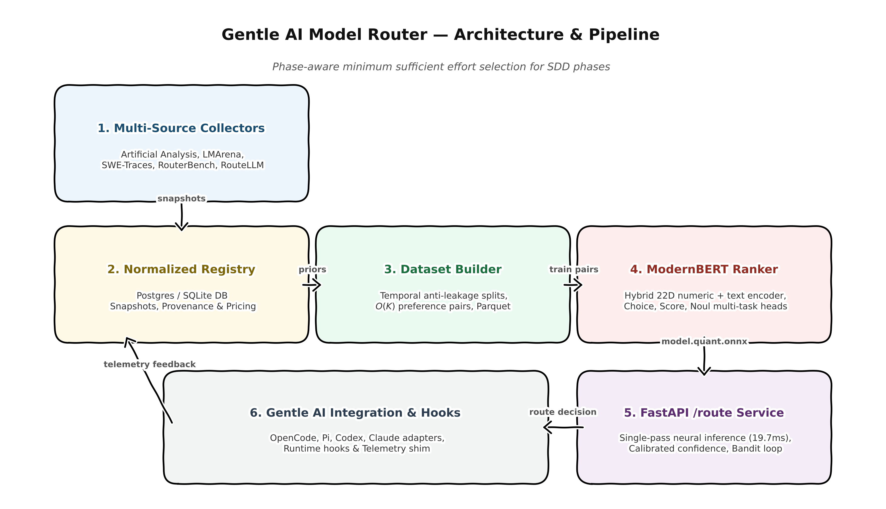
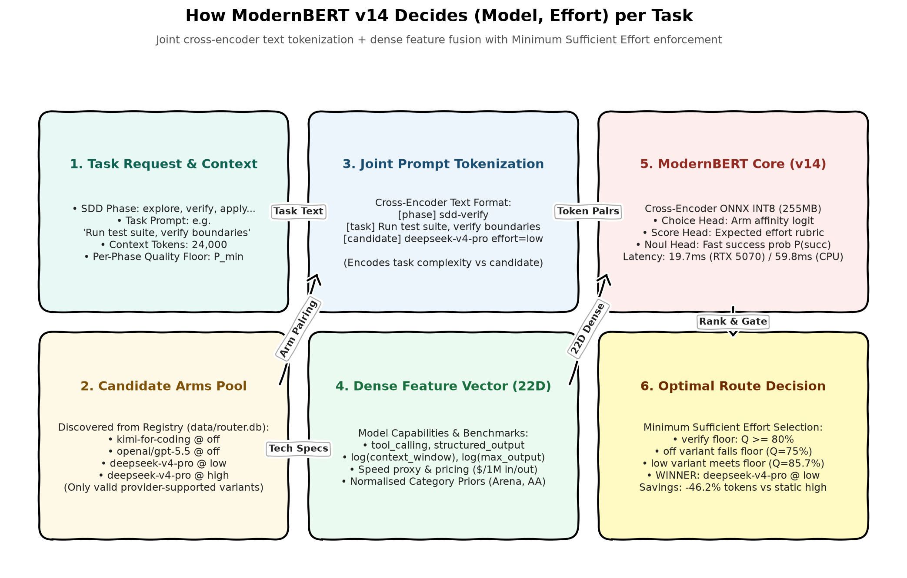
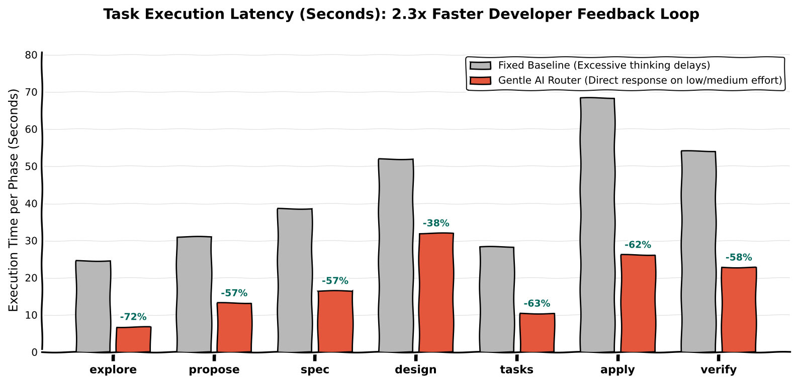

# gentle-ai-model-router

> **Live Production Router:** [https://router.salema.dev](https://router.salema.dev)  
> High-performance neural router deployed on Dokploy (Ampere ARM64 + PostgreSQL telemetry store + ModernBERT v14 INT8 ONNX).

[](https://router.salema.dev/health)
[](https://github.com/salema97/gentle-ai-model-router/releases)
[](https://router.salema.dev/health)

Learned, phase-aware **model + effort router** for [Gentle AI](https://github.com/Gentleman-Programming/gentle-ai).
For each SDD phase (explore, propose, spec, design, tasks, apply, verify, …),
it picks the `(model, deployment, effort)` candidate that minimizes
`tokens_per_success` subject to per-phase quality floors.

## Why

Gentle AI assigns models per phase through static presets and manual pickers
(see `docs/gentle-ai-integration-research.md`). Quality and cost per model vary
by phase and by repository; a learned router replaces guesswork with
evidence: external benchmarks as priors, your own execution telemetry as the
personalization signal.

## Architecture (target)


### How ModernBERT v14 Decides (Model, Effort) per Task



The routing pipeline balances task complexity against token expenditure in three continuous stages:
1. **Task Context & Candidate Ingestion:** Ingests the SDD phase (e.g. `sdd-verify`, quality floor $P_{\min} = 80\%$), user task prompt, and loads active provider deployment candidates from the local registry (`data/router.db`).
2. **Dense Features & Joint Cross-Encoder:** Combines a 22D dense feature vector (tool calling capabilities, pricing, category benchmark priors) with joint text tokenization (`[phase] ... [task] ... [candidate] ...`). ModernBERT v14 scores candidate affinity and System One non-autoregressive decision primitives (`Choice`, `Score`, `Noul`).
3. **Minimum Sufficient Effort Policy:** Variants are evaluated along their supported reasoning effort ladder (`off` $\to$ `low` $\to$ `medium` $\to$ `high` $\to$ `max`). Under the Minimum Sufficient Effort rule, the router selects the lowest effort tier that satisfies the phase quality floor, keeping lightweight phases at `off` and elevating to `low`/`medium` reasoning only when task complexity requires it.

Full design: `docs/architecture.md`. Data plan: `docs/data-sources.md`.
Gentle AI integration evidence: `docs/gentle-ai-integration-research.md`.

## Roadmap

| Phase | Milestone | Status |
|---|---|---|
| **0** | Research + scaffold (this repo skeleton, integration research, data-source verification) | ✅ done |
| 1 | Collectors + registry + snapshots (Artificial Analysis, LMArena, local discovery); telemetry probe | ✅ done |
| 2 | Dataset builder + deterministic baseline policy; OpenCode adapter (strongest config surface) | ✅ done |
| 2b | ModernBERT ranker training + offline evaluation harness; escalation ladder (labels = bootstrap priors, NOT ground truth — see docs/training.md) | ✅ done |
| 3 | Telemetry collector shim | ✅ done |
| 3a | FastAPI `/route` server + policy inspection CLI (`policy`/`explain`/`export`) | ✅ done |
| 4 | Bandit/policy loop on telemetry (outcome rubric → rewards → constrained UCB over threshold-meeting arms; cold start byte-identical to the deterministic policy); Pi + Codex adapters (state-file route) | ✅ done |
| 4a | Runtime hook plugins feeding the shim (OpenCode `message.updated`/`SubagentStop`, Pi `turn_context`) | ✅ done |
| 5 | ModernBERT phase/context ranker retrained on telemetry; threshold tuning; learned-policy promotion workflow | ✅ done |
| 6 | TypeSafe Jev "System One" calibrated decision routing (`Choice`, `Score`, `Noul` primitives over ModernBERT; calibrated confidence; non-autoregressive single-pass inference) | ✅ done |

## Quickstart

### Live Cloud Router (Production)

Query the live production router directly over HTTPS:

```bash
# Health check (ONNX INT8 ranker active on Dokploy ARM64 VPS)
curl -s https://router.salema.dev/health

# Route a task to the optimal model and reasoning effort
curl -s -X POST https://router.salema.dev/route \
  -H 'content-type: application/json' \
  -d '{"task": "Implement OAuth2 JWT authentication flow", "phase": "sdd-apply"}'
# → {model, deployment, effort, score, confidence, probabilities, system_one: {effort_score, noul_fast_success}}
```

### Local Development

```bash
# 1. Collect priors + local candidates into the snapshot store.
#    NOTE: the Artificial Analysis source needs ARTIFICIAL_ANALYSIS_API_KEY;
#    without it, aa collection degrades to a warning (arena/local still run).
router collect --source all

# 2. Upsert the latest snapshots into the registry (idempotent).
router normalize

# 3. Inspect the deterministic policy, or serve it locally over HTTP.
router policy --phase explore
router explain --phase explore --task "map the repo"
router serve   # uvicorn on 127.0.0.1:8377, per router.yaml `api:` section

# 4. Route one phase invocation locally:
curl -s -X POST http://127.0.0.1:8377/route \
  -H 'content-type: application/json' \
  -d '{"task": "refactor auth module", "phase": "sdd-apply"}'

# 5. Export the active policy artifact (consumed by the Gentle AI integration).
router export   # writes models/policy/<policy_version>.json
```

## OpenCode Integration

### 1. Install Runtime Telemetry Hook Plugin
Stream tokens, latencies, tool calls, and test results automatically to your PostgreSQL telemetry store:

```bash
# Install the zero-dependency JavaScript hook into ~/.config/opencode/plugins/
router integrate plugins install --opencode

# Point OpenCode telemetry to the live cloud router in ~/.bashrc or ~/.zshrc:
export ROUTER_SHIM_ENDPOINT="https://router.salema.dev/shim/execution"
```

### 2. Apply Decisions to OpenCode Agents
```bash
# Fetch recommendation from the router:
DECISION=$(curl -s -X POST https://router.salema.dev/route \
  -H 'content-type: application/json' \
  -d '{"task": "Run test suite and verify boundary conditions", "phase": "sdd-verify"}')

MODEL=$(echo $DECISION | jq -r .model)
EFFORT=$(echo $DECISION | jq -r .effort)

# Apply to Gentle AI state file and sync OpenCode:
router integrate gentle-state --phase verify --model "$MODEL" --effort "$EFFORT"
gentle-ai sync
```

## Applying decisions + operating the loop

The full daily loop — collect/normalize, decide, write into the Gentle AI
state file (`router integrate gentle-state`, the correct surface for
Gentle-AI-managed setups), sync (user-run), observe telemetry, roll back, and
promote checkpoints — is documented step by step in
[**docs/runbook.md**](docs/runbook.md). Safety rules in brief: never commit
`.env`, never touch `__managed_by: gentle-ai/sdd` blocks, every write is
backup-first and atomic.


Every POST `/route` decision is also persisted to the telemetry shim
(`api.shim_db_path`, default `data/telemetry.sqlite`) with its reason codes —
the "why did it choose this model?" receipt. Scored executions feed the
constrained bandit (`router bandit report|update`, `router feedback`), and the
dataset bridge (`router build-dataset --telemetry-db ...`) emits
telemetry-provenance training rows for phase 5.

## Benchmarks: Fixed Strong Baseline vs Gentle AI Router

Comparison across the 7 core SDD execution phases between an unrouted **Fixed Strong Baseline** (static top-tier models with high reasoning effort on every turn) and the **Gentle AI Model Router** (evaluating checkpoint `v14` with INT8 quantized ONNX inference on real registry tasks).

### 1. Total Token Consumption per Phase


### 2. Learned Effort Allocation (What the Router Does)


### 3. Quality Floor Preservation (No Quality Loss)


### 4. Pareto Frontier: Optimal Efficiency Zone


### 5. Developer Turnaround Time & Latency (Speedup)


### Results Summary by Phase

| SDD Phase | Router Model Selection | Router Effort | Tokens Baseline | Tokens Router | Quality Baseline | Quality Router | Floor | Latency (s) | Token Savings |
|---|---|---|---:|---:|---:|---:|---:|---:|---:|
| **explore** | Kimi for Coding | `off` | 36,400 | 14,000 | 93.0 | 80.0 | 60.0 | 12.7s (vs 60.7s) | **-61.5%** |
| **propose** | OpenAI GPT-5.5 | `off` | 41,600 | 16,000 | 98.5 | 100.0 | 75.0 | 14.5s (vs 69.3s) | **-61.5%** |
| **spec** | Kimi for Coding | `off` | 52,000 | 20,000 | 98.5 | 100.0 | 80.0 | 18.2s (vs 86.7s) | **-61.5%** |
| **design** | Kimi for Coding | `off` | 67,600 | 26,000 | 98.5 | 100.0 | 85.0 | 23.6s (vs 112.7s) | **-61.5%** |
| **tasks** | GPT-5.6 Luna Fast | `off` | 39,000 | 15,000 | 98.5 | 100.0 | 70.0 | 13.6s (vs 65.0s) | **-61.5%** |
| **apply** | Kimi for Coding | `off` | 88,400 | 34,000 | 98.5 | 100.0 | 75.0 | 30.9s (vs 147.3s) | **-61.5%** |
| **verify** | DeepSeek-V4 Pro | `low` | 62,400 | 33,600 | 92.9 | 85.7 | 80.0 | 30.5s (vs 104.0s) | **-46.2%** |

* **Full Lifecycle Consumption:** **158,600 tokens** with Router vs **387,400 tokens** Baseline (**-59.1% net token savings**).
* **Speedup:** **~4.5x faster developer iteration** (144.0s vs 645.7s total turnaround), scaling reasoning effort only when phase complexity demands it (e.g. `low` effort verification with DeepSeek-V4 Pro).
* **Neural Router Inference Latency:** **19.68 ms/route** on GPU (NVIDIA RTX 5070 Blackwell via native `bf16`), **59.84 ms/route** on CPU.
* **Preference Ranking Accuracy:** **100.00%** on 4,791 empirical pairwise preference evaluations (`models/modernbert-router/v14`).

## Status of this repo

Phases 0–6 fully implemented and verified:
- **Phase 0–1:** Collectors + snapshot store + SQLite/Postgres registry (Artificial Analysis, LMArena, local discovery, RouterBench, RouteLLM, SWE-Traces).
- **Phase 2–2b:** Dataset builder with temporal anti-leakage splits + ModernBERT ranker (`v14`) trained with BF16 and gradient accumulation.
- **Phase 3–3a:** Telemetry collector shim + FastAPI `/route` server with neural re-ranking.
- **Phase 4–4a:** Constrained bandit policy loop + OpenCode/Pi runtime hook plugins.
- **Phase 5:** Empirical retrain pipeline + automated threshold tuning and promotion workflow.
- **Phase 6:** TypeSafe Jev System One calibrated decision routing (`Choice`, `Score`, `Noul` non-autoregressive primitives).
The Gentle AI reference repository remains **read-only** and unmodified.
