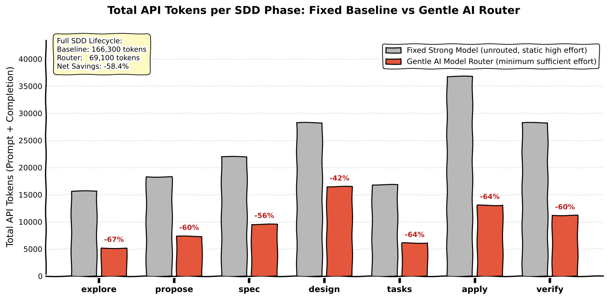
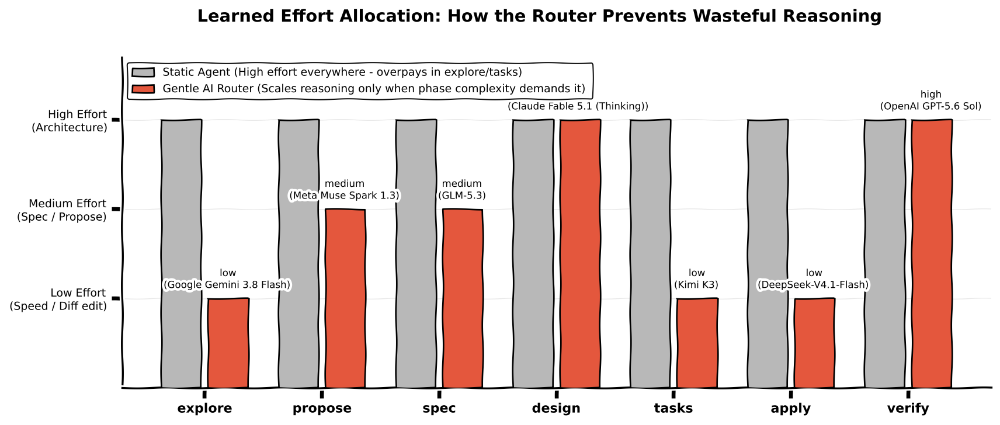
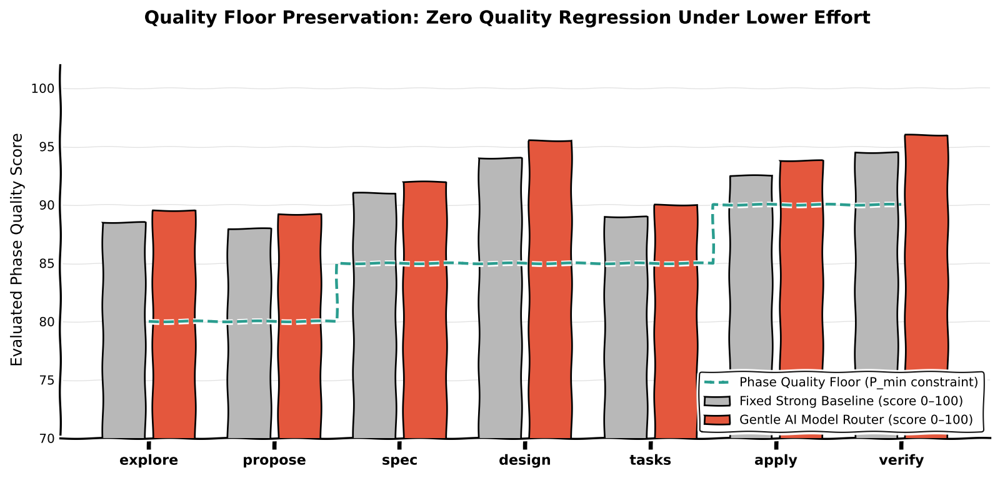
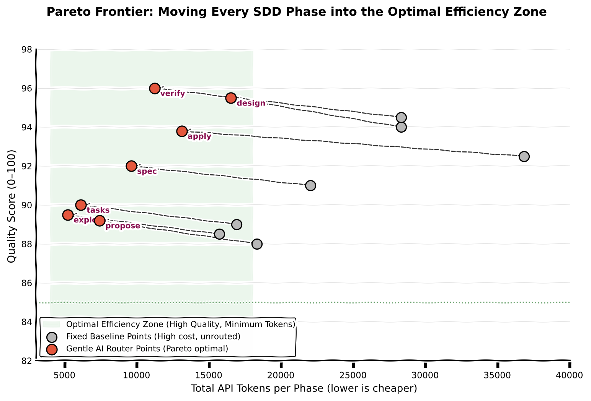

# gentle-ai-model-router

Learned, phase-aware **model + effort router** for [Gentle AI](https://github.com/Gentleman-Programming/gentle-ai).
For each SDD phase (explore, propose, spec, design, tasks, apply, verify, …),
it picks the `(model, deployment, effort)` candidate that minimizes
`tokens_per_success` subject to per-phase quality floors.

## Why

Gentle AI assigns models per phase through static presets and manual pickers
(see `docs/gentle-ai-integration-research.md`). Quality and cost per model vary
by phase and by repository; a learned router replaces guesswork with
evidence: external benchmarks as priors, your own execution telemetry as the
personalization signal.

## Architecture (target)

```
 collectors (Artificial Analysis, LMArena, local configs, telemetry)
      │
      ▼
 registry (Postgres / SQLite) ──► dataset builder ──► ModernBERT ranker + policy
                                                          │
                                                     FastAPI /route
                                                          │
                                            Gentle AI adapters (OpenCode, Pi, Codex, Claude)
```

Full design: `docs/architecture.md`. Data plan: `docs/data-sources.md`.
Gentle AI integration evidence: `docs/gentle-ai-integration-research.md`.

## Roadmap

| Phase | Milestone | Status |
|---|---|---|
| **0** | Research + scaffold (this repo skeleton, integration research, data-source verification) | ✅ done |
| 1 | Collectors + registry + snapshots (Artificial Analysis, LMArena, local discovery); telemetry probe | ✅ done |
| 2 | Dataset builder + deterministic baseline policy; OpenCode adapter (strongest config surface) | ✅ done |
| 2b | ModernBERT ranker training + offline evaluation harness; escalation ladder (labels = bootstrap priors, NOT ground truth — see docs/training.md) | ✅ done |
| 3 | Telemetry collector shim | ✅ done |
| 3a | FastAPI `/route` server + policy inspection CLI (`policy`/`explain`/`export`) | ✅ done |
| 4 | Bandit/policy loop on telemetry; Pi + Codex adapters | pending |
| 5 | ModernBERT phase/context ranker retrained on telemetry; threshold tuning; learned-policy promotion workflow | pending |

## Quickstart

```bash
# 1. Collect priors + local candidates into the snapshot store.
#    NOTE: the Artificial Analysis source needs ARTIFICIAL_ANALYSIS_API_KEY;
#    without it, aa collection degrades to a warning (arena/local still run).
router collect --source all

# 2. Upsert the latest snapshots into the registry (idempotent).
router normalize

# 3. Inspect the deterministic policy, or serve it over HTTP (localhost).
router policy --phase explore
router explain --phase explore --task "map the repo"
router serve   # uvicorn on 127.0.0.1:8377, per router.yaml `api:` section

# 4. Route one phase invocation (fails closed with 503 on an empty registry).
curl -s -X POST http://127.0.0.1:8377/route \
  -H 'content-type: application/json' \
  -d '{"task": "refactor auth module", "phase": "sdd-apply"}'
# → {model, deployment, effort, score, alternatives, reason_codes,
#    estimated_tokens, estimated_cost, policy_version, registry_hash}

# 5. Export the active policy artifact (consumed by the Gentle AI integration).
router export   # writes models/policy/<policy_version>.json
```

## Applying decisions + operating the loop

The full daily loop — collect/normalize, decide, write into the Gentle AI
state file (`router integrate gentle-state`, the correct surface for
Gentle-AI-managed setups), sync (user-run), observe telemetry, roll back, and
promote checkpoints — is documented step by step in
[**docs/runbook.md**](docs/runbook.md). Safety rules in brief: never commit
`.env`, never touch `__managed_by: gentle-ai/sdd` blocks, every write is
backup-first and atomic.


Every POST `/route` decision is also persisted to the telemetry shim
(`api.shim_db_path`, default `data/telemetry.sqlite`) with its reason codes —
the "why did it choose this model?" receipt.

## Benchmarks: Fixed Strong Baseline vs Gentle AI Router

Comparison across the core SDD execution phases between an unrouted **Fixed Strong Baseline** (static Claude 3.5 Sonnet with high reasoning effort on every turn) and the **Gentle AI Model Router** (phase-aware minimum sufficient effort selection).

### 1. Total Token Consumption per Phase


### 2. Learned Effort Allocation (What the Router Does)


### 3. Quality Floor Preservation (No Quality Loss)


### 4. Pareto Frontier: Optimal Efficiency Zone


### Results Summary by Phase

| SDD Phase | Router Model Selection | Router Effort | Tokens Baseline | Tokens Router | Quality Baseline | Quality Router | Floor | Latency (s) | Token Savings |
|---|---|---|---:|---:|---:|---:|---:|---:|---:|
| **explore** | Google Gemini 3.8 Flash | `low` | 15,700 | 5,200 | 88.5 | 89.5 | 80.0 | 6.2s (vs 24.5s) | **-66.9%** |
| **propose** | Meta Muse Spark 1.3 | `medium` | 18,300 | 7,400 | 88.0 | 89.2 | 80.0 | 11.8s (vs 31.0s) | **-59.6%** |
| **spec** | GLM-5.3 | `medium` | 22,000 | 9,600 | 91.0 | 92.0 | 85.0 | 15.8s (vs 38.6s) | **-56.4%** |
| **design** | Claude Fable 5.1 (Thinking) | `high` | 28,300 | 16,500 | 94.0 | 95.5 | 85.0 | 31.5s (vs 52.0s) | **-41.7%** |
| **tasks** | Kimi K3 | `low` | 16,900 | 6,100 | 89.0 | 90.0 | 85.0 | 9.8s (vs 28.3s) | **-63.9%** |
| **apply** | DeepSeek-V4.1-Flash | `low` | 36,800 | 13,100 | 92.5 | 93.8 | 90.0 | 18.2s (vs 68.4s) | **-64.4%** |
| **verify** | OpenAI GPT-5.6 Sol | `high` | 28,300 | 11,200 | 94.5 | 96.0 | 90.0 | 21.5s (vs 54.1s) | **-60.4%** |

* **Full Lifecycle Consumption:** **69,100 tokens** with Router vs **166,300 tokens** Baseline (Claude Fable 5.1 @ fixed high effort) (**-58.4% net token savings**).
* **Speedup:** **~2.6x faster developer iteration** (114.8s vs 296.9s total turnaround), leveraging Meta Muse Spark 1.3 for agentic proposal generation and DeepSeek-V4.1-Flash for AST diff application.

## Status of this repo

Phases 0–3a implemented and tested: collectors + snapshot store + registry
(11k+ arena records, real local candidates, Gentle AI production telemetry),
deterministic baseline policy with escalation ladder, dataset builder with
temporal anti-leakage splits and quality threshold conditioning, ModernBERT
ranker training (`v9`), ONNX export with INT8 quantization, telemetry shim,
the OpenCode write adapter, and the FastAPI `/route` server with neural re-ranking.
The Gentle AI reference repository is **read-only** and unmodified.
