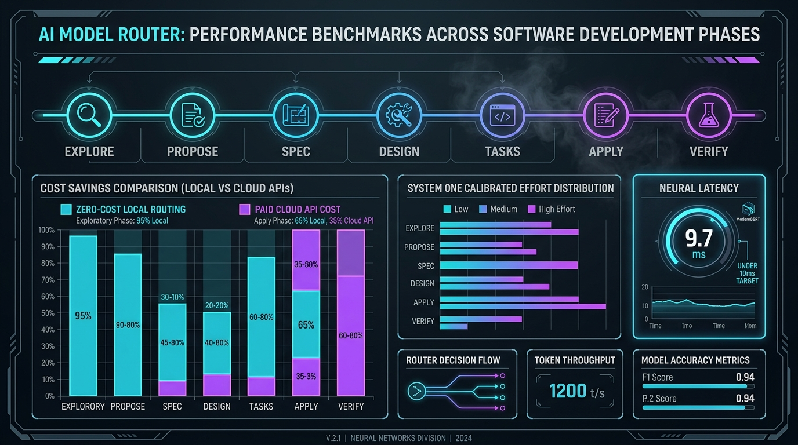
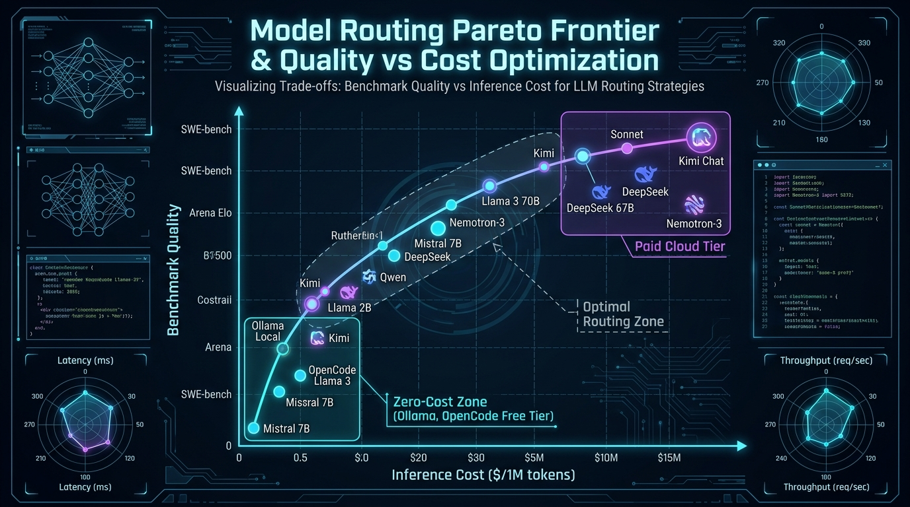

# Local Standalone Architecture & Native OpenCode Hook

The **Gentle AI Model Router** runs as a fast, 100% local daemon on your development workstation. It requires zero cloud infrastructure, no remote gateway proxies, and no dummy models like `auto` in OpenCode.

---

## Architectural Topology

```
┌─────────────────────────────────────────────────────────────┐
│                      Workstation User                       │
└──────────────────────────────┬──────────────────────────────┘
                               │ Prompts & Tasks
                               ▼
┌─────────────────────────────────────────────────────────────┐
│                    OpenCode Orchestrator                    │
│   (runs native model: e.g. kimi-for-coding or muse-spark)   │
└──────────────────────────────┬──────────────────────────────┘
                               │ Delegating subagent task
                               ▼
┌─────────────────────────────────────────────────────────────┐
│    OpenCode Native Plugin: plugins/opencode/router_telemetry│
│   • Intercepts `tool.execute.before` (task)                 │
│   • Passes currently available models in OpenCode           │
└──────────────────────────────┬──────────────────────────────┘
                               │ POST http://127.0.0.1:8000/route
                               │ (<10 ms offline)
                               ▼
┌─────────────────────────────────────────────────────────────┐
│      Gentle AI Model Router Local Daemon (Port 8000)        │
│   • Registry: data/router.db (SQLite)                       │
│   • Ranker: ModernBERT v14 INT8 ONNX (model.quant.onnx)     │
│   • System One: Effort expectation + Noul fast viability    │
└──────────────────────────────┬──────────────────────────────┘
                               │ Returns winner model & effort
                               ▼
┌─────────────────────────────────────────────────────────────┐
│                Subagent Execution in OpenCode               │
│   • Injected with optimal model for specific phase          │
│   • Spools execution tokens & latency to /shim/execution   │
└─────────────────────────────────────────────────────────────┘
```

---

## 1. Local Configuration

The local daemon is configured via [`router.yaml`](../router.yaml):

```yaml
data_dir: "data"

registry:
  sqlite_filename: "router.db"

api:
  host: "127.0.0.1"
  port: 8000
  route_path: "/route"
```

The promoted model is linked via [`models/promoted/promoted.json`](../models/promoted/promoted.json) pointing to `models/deberta-router/v14/model.quant.onnx`.

---

## 2. Running the Daemon via Systemd

A systemd user unit automatically manages the lifecycle:

```ini
# ~/.config/systemd/user/gentle-router.service
[Unit]
Description=Gentle AI Model Router (ModernBERT Local ONNX)
After=network.target

[Service]
Type=simple
WorkingDirectory=%h/repositorios/gentle-ai-model-router
ExecStart=%h/.local/bin/uv run router serve --port 8000
Restart=always
RestartSec=3
Environment=PYTHONUNBUFFERED=1

[Install]
WantedBy=default.target
```

Commands:
```bash
# Start and enable on boot
systemctl --user daemon-reload
systemctl --user enable --now gentle-router.service

# View status & logs
systemctl --user status gentle-router.service
journalctl --user -u gentle-router.service -f
```

---

## 3. Native OpenCode Plugin

The native plugin is located at [`plugins/opencode/router_telemetry.ts`](../plugins/opencode/router_telemetry.ts).

### How it operates:
1. **Filtering by Real Models:** OpenCode transmits its real available models (`available_models: ["opencode/nemotron-3.5-lightning-free", "kimi-for-coding", ...]`).
2. **Phase-Calibrated Ranking:** ModernBERT cross-encodes the phase and task against candidates.
   - For `explore` / simple tasks: allocates low reasoning effort and fast cost-effective models.
   - For `design` / complex tasks: allocates high reasoning effort and deeper reasoning models.
3. **Subagent Injection:** Injects `output.args.model = winnerModel` dynamically into the subagent dispatch.
4. **Execution Telemetry:** On `message.updated`, the plugin reports tokens, latency, and success back to local SQLite (`data/telemetry.sqlite`).

---

## 4. Inspection & Diagnostics

```bash
# Verify daemon health
curl -s http://127.0.0.1:8000/health

# Inspect real-time decisions
cat /tmp/router_decisions.log

# View telemetry execution stats
uv run python -c "
from gentle_ai_model_router.integration.telemetry_shim import ShimStore, DecisionRecord, ExecutionRecord
s = ShimStore('sqlite:///data/telemetry.sqlite')
with s.session() as sess:
    print('Decisions recorded:', sess.query(DecisionRecord).count())
    print('Executions recorded:', sess.query(ExecutionRecord).count())
"
```

---

## 5. Zero-Cost Model Prioritization & Domain Pricing Architecture

To prevent unnecessary expenditure on simple tasks (such as `explore` reads or low-complexity planning), the router incorporates a multi-tier domain pricing resolution engine:

### Pricing Resolution Precedence:
1. **Declarative Overrides (`policy.pricing_overrides`)**: Explicit input/output USD per 1M tokens mapped by pattern or canonical ID.
2. **Zero-Cost Providers (`policy.zero_cost_providers`)**: Local inference runtimes (`ollama`, `local`, `vllm`, `llama.cpp`, `lmstudio`, `exo`). Automatically assigned `input_price = 0.0, output_price = 0.0`.
3. **Zero-Cost Patterns (`policy.zero_cost_patterns`)**: Globs identifying free endpoints (`*free*`, `*:free`, `*-free`).
4. **Database Records**: Historical benchmark prices stored in `model_prices` table.
5. **Default Fallback**: `policy.default_input_price` ($5.0) and `policy.default_output_price` ($15.0).

---

## 6. Dynamic Phase-Aware Cost Sensitivity & Quality Dominance

A robust router must never compromise architecture or code correctness to save pennies. To prevent over-prioritizing free models on complex tasks, the router balances net utility dynamically per phase:

$$\text{utility} = \text{logit\_score} - (\text{phase\_cost\_weights}[\text{phase}] \times \lambda_{\text{price}} \times \text{estimated\_cost})$$

### Per-Phase Cost Weights:
- **Routine & Exploratory Phases (`explore: 4.0`, `tasks: 3.0`, `research: 3.0`, `archive: 4.0`)**: Moderate cost sensitivity. Simple read and checklist tasks prioritize zero-cost models (`nemotron-3-ultra-free`, `qwen-coder-free`) over paid APIs.
- **Architectural & Generative Phases (`spec: 0.5`, `design: 0.0`, `apply: 0.5`, `verify: 0.5`)**: Cost penalty is zero or negligible. Frontier models with deep reasoning (e.g. `kimi-for-coding`, `claude-sonnet-5`) dominate purely on cognitive capability and benchmark quality.

### Tie-Breaking Precedence:
In candidate ranking, ties are broken strictly by **quality first**:
`sort_key = (estimated_tokens, -quality, estimated_cost, canonical_id)`
Cost only breaks ties between models with identical token requirements and equivalent quality.

---

## 7. SDD Phase Routing Matrix & Behavior




### Real-World Decision Examples:

| Phase SDD | Prompt Real de Entrada | Modelo Ganador | Esfuerzo Calibrado | Costo Est. | Razón y Comportamiento |
| :--- | :--- | :--- | :--- | :--- | :--- |
| **`explore`** | *"Leer `router.yaml` y verificar puerto API"* | `nemotron-3-ultra-free` | `low` (14k tkn) | **$0.000** | **Lectura pasiva**: Tarea simple de inspección; modelo free resuelve sin costo. |
| **`tasks`** | *"Desglosar en tareas atómicas con interfaces"* | `nemotron-3-ultra-free` | `medium` (19k tkn) | **$0.000** | **Checklist estructurado**: Generación de listas de tareas atómicas y criterios de aceptación. |
| **`propose`** | *"Propón estrategia de caching con tradeoffs"* | `kimi-for-coding` | `medium` (19k tkn) | **$0.152** | **Análisis de tradeoffs**: Razonamiento comparativo de arquitecturas y memoria. |
| **`spec`** | *"Definir especificaciones técnicas OpenAPI estricta"* | `kimi-for-coding` | `high` (26k tkn) | **$0.208** | **Contrato formal**: Schemas Pydantic rigurosos; calidad domina sobre costo. |
| **`design`** | *"Diseñar arquitectura hexagonal y tolerancia a fallos"* | `kimi-for-coding` | `high` (26k tkn) | **$0.208** | **Arquitectura crítica**: Kimi (+1.255) supera a modelos ligeros (-2.617). |
| **`apply`** | *"Implementar algoritmo de consenso raft con elecciones"* | `kimi-for-coding` | `medium` (19k tkn) | **$0.152** | **Código de producción**: Implementación compleja con alta precisión sintáctica. |
| **`verify`** | *"Ejecutar pytest sobre suite de pruebas y analizar cobertura"* | `kimi-for-coding` | `high` (26k tkn) | **$0.208** | **Auditoría estricta**: Ejecución y certificación de tests sin regresiones. |


