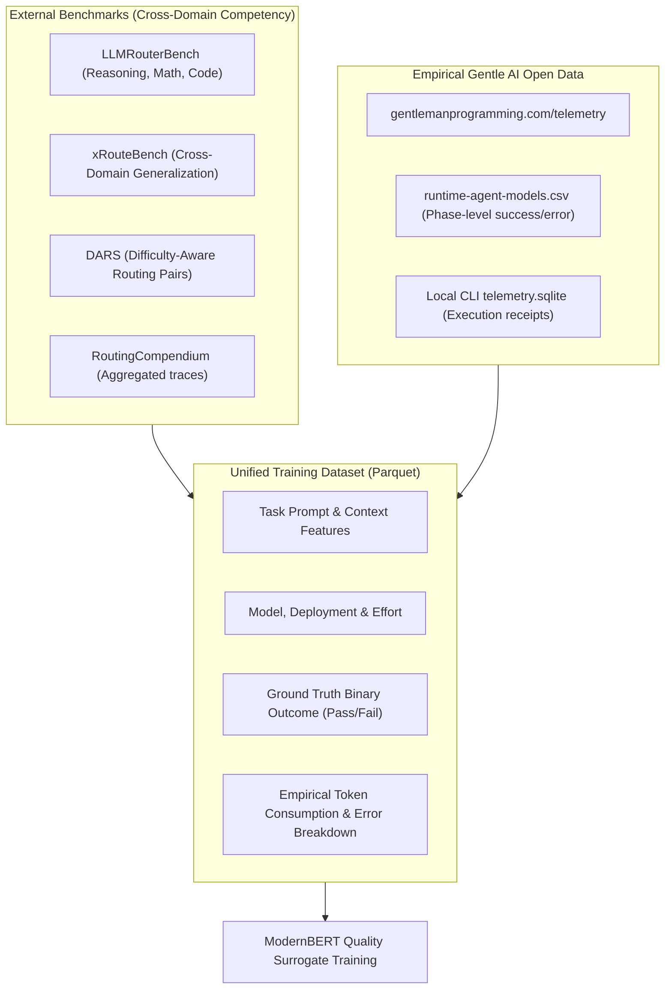
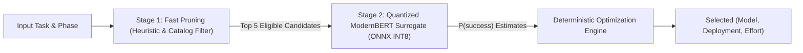

# Decoupled Surrogate Quality Router Architecture

## 1. Executive Summary

This document specifies the architectural evolution of `gentle-ai-model-router` from a **monolithic utility scoring ranker** to a **Decoupled Quality Surrogate Model** coupled with a **Deterministic Multi-Objective Decision Engine**.

In the monolithic design, a neural ranker attempts to predict a combined scalar utility score that blends model intelligence, token pricing, latency, and phase constraints. In the decoupled architecture:
1. **The neural model predicts only what is truly stochastic:** the probability that candidate $(m, e)$ will successfully complete task $x$ ($\hat{Q}(x, m, e) \in [0, 1]$).
2. **The decision engine computes what is strictly deterministic:** exact token costs, hardware latencies, and SLA hard floors.
3. **The router solves an explicit constrained optimization problem:** minimizing `tokens_per_success` (or total cost) subject to phase-level quality guarantees ($\hat{Q} \ge \tau_{\text{phase}}$).

---

## 2. Mathematical Formulation

### 2.1 Quality Surrogate $\hat{Q}(x, m, e)$

Let:
- $x$: task representation (prompt, SDD phase, repository context, task type).
- $m$: candidate model identity and static architecture capabilities.
- $e \in \{\text{off}, \text{low}, \text{medium}, \text{high}, \text{max}\}$: reasoning effort variant.

The surrogate model $f_\theta$ predicts expected execution quality / success probability:
$$\hat{Q}(x, m, e) = \sigma\left( \text{MLP}\left( \text{ModernBERT}(x, m, e) \oplus \mathbf{v}_{\text{numeric}} \right) \right) \in [0, 1]$$

Trained using binary cross-entropy on empirical execution outcomes:
$$\mathcal{L}_{\text{BCE}} = - \sum_{i} \left[ y_i \log \hat{Q}_i + (1 - y_i) \log (1 - \hat{Q}_i) \right]$$
where $y_i \in \{0, 1\}$ is empirical task success (e.g. unit tests passed, zero abort/error in agent trace).

### 2.2 Deterministic Cost & Latency Functions

Unlike quality, cost and latency follow closed-form deterministic relationships:
- **Estimated Cost:**
  $$\text{Cost}(x, m) = \frac{\text{Tokens}_{\text{in}}(x) \cdot P_{\text{in}}(m) + \text{Tokens}_{\text{out}}(x, e) \cdot P_{\text{out}}(m)}{10^6}$$
- **Estimated Latency:**
  $$\text{Latency}(x, m, e) = \text{TTFT}(m) + \frac{\text{Tokens}_{\text{out}}(x, e)}{\text{TPS}(m)}$$

### 2.3 Optimization Objective: Minimum-Sufficient Effort

The candidate selector solves:
$$(m^*, e^*) = \arg\min_{(m, e) \in \mathcal{C}} \frac{\text{Cost}(x, m)}{\hat{Q}(x, m, e)} \quad \text{s.t.} \quad \hat{Q}(x, m, e) \ge \tau_{\text{phase}}$$

If no candidate meets $\tau_{\text{phase}}$, the policy fails closed or initiates an explicit fallback/escalation ladder.

---

## 3. Unified Ingestion Pipeline & Data Harmonization

To train a robust surrogate, the training pipeline harmonizes public academic routing benchmarks with Gentle AI real-world execution traces:

### Dataset Schema (`TaskOutcomeRecord`)
- `task_id`: SHA-256 hash of task prompt.
- `domain`: `coding` | `reasoning` | `sdd-phase` (e.g., `sdd-apply`, `sdd-verify`).
- `prompt_tokens`: integer input context length.
- `candidate_model`: canonical provider/model slug.
- `effort`: reasoning level.
- `success`: boolean (`1` = verified passing run, `0` = compile error, test failure, exception).
- `tokens_spent`: total tokens consumed.
- `source`: `llm_router_bench` | `dars` | `gentle_ai_telemetry`.

---

## 4. Latency Mitigation & Deployment Topology

Evaluating a heavy PyTorch transformer model inside a local CLI for dozens of candidate models introduces unacceptable latency (300–600 ms). Production deployment follows a **Two-Stage Cascade Architecture**:

1. **Stage 1 (Sub-millisecond Pre-filtering):**
   - Eliminates models violating hard context window limits.
   - Filters models without required capabilities (e.g., `tool_calling` in `apply`).
   - Retains top $K=5$ candidate models using catalog priors.
2. **Stage 2 (Quantized Inception):**
   - The ModernBERT surrogate is exported to **ONNX format** and quantized to **INT8**.
   - Executed via `onnxruntime` in C++ / CPU with zero PyTorch runtime dependency.
   - Inference latency: $< 3\text{ ms}$ for scoring 5 candidate models.
